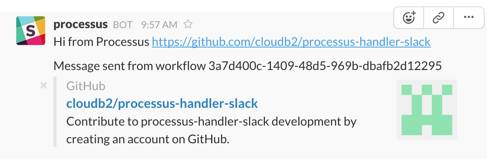

# processus-handler-slack

A Processus handler to send messages to Slack via its incoming WebHook

[](https://nodejs.org/en/)
[](https://www.npmjs.com/package/processus-handler-slack)
[](https://github.com/cloudb2/processus/blob/master/LICENSE)

<hr>

# Getting Started

Using the Processus handler for Slack's incoming webhooks is relatively simple. Choose one of the
installation options below and then invoke from your project using the API or
from the command line (example below).

Make sure you have the an incoming webhook configured for your Slack team and you
know the URL. See [https://api.slack.com/incoming-webhooks](https://api.slack.com/incoming-webhooks) for more information.

## Installation

There are 2 options:

### Using NPM

If you haven't already, install Processus
```
npm install --save processus
```
Then install this handler
```
npm install --save processus-handler-slack
```

### Clone this repo
```
git clone https://github.com/cloudb2/processus-handler-slack
cd processus-handler-slack
npm install
```

## Testing the Example

Set up an incoming webhook integration in your Slack team as mentioned in
[https://api.slack.com/incoming-webhooks](https://api.slack.com/incoming-webhooks)
and make a note of the webhookURL and channel you wish to use.

### Configure the example
Update the ```[webhookURL]``` and ```[#channel or @user]``` according to your slack team.

***Note***
If you cloned the repo change the handler property ```processus-handler-slack``` to ```../../../processus-handler-slack```

```
---
  name: "Demo Slack"
  description: "A demo showing the use of the slack handler to make a incoming webhook call."
  tasks:
    Send a message to Slack's incoming WebHook.:
      blocking: true
      handler: "processus-handler-slack"
      properties:
        webhookURL: "[webhookURL]"
        payload:
          username: "processus"
          channel: "[#channel or @user]"
          text: "Hi from Processus https://github.com/cloudb2/processus-handler-slack\n\nMessage sent from workflow $[id]"
          icon_url: "https://slack.com/img/icons/app-57.png"
          unfurl_links: true

```

### Example Usage from CLI

```
./node_modules/processus/bin/processus-cli -l info -f example.yml
```

You should see something similar to the following on the command line
```

  ____  ____   __    ___  ____  ____  ____  _  _  ____
 (  _ \(  _ \ /  \  / __)(  __)/ ___)/ ___)/ )( \/ ___)
  ) __/ )   /(  O )( (__  ) _) \___  \___ \) \/ (\___ \
 (__)  (__\_) \__/  \___)(____)(____/(____/\____/(____/

           Processus: A Simple Workflow Engine.

info: reading workflow file [local-example.json]
info: ⧖ Starting task [Send a message to Slack's incoming WebHook.]
info: ✰ Workflow [local-example.json] with id [f1ed1989-2d36-473d-b0b6-ce5fad3b897c] completed successfully.

```

In your slack team and channel you should a message.


That's it!

See the [Slack Incoming Webhooks](https://api.slack.com/incoming-webhooks) and [Processus User Guide](http://cloudb2.github.io/processus/) for more details on how this can be used.
